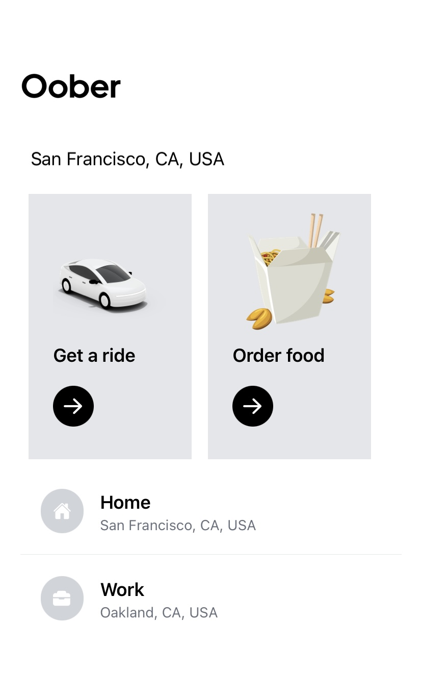
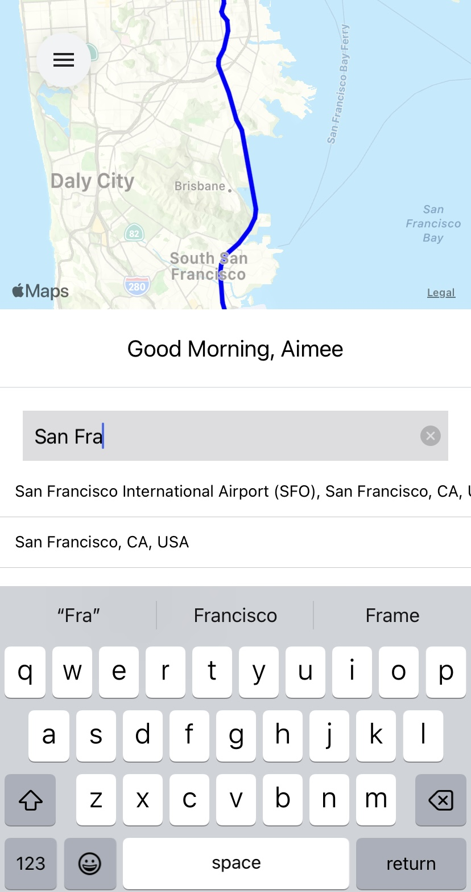
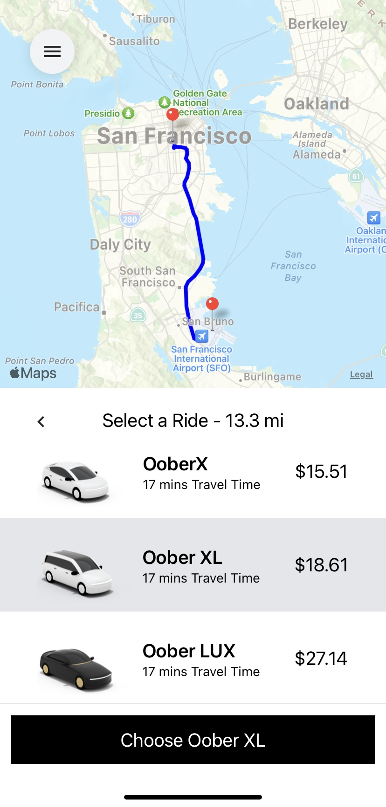

# Oober
This is an Uber Clone for a React Native project. Features of this app includes location search auto complete, start and end destination markers, vehicle type, trip overview with price, total miles, and ETA.

## Technology Stack:
- React Native
- React Native Maps
- React Navigation
- React Native Elements
- Redux
- Tailwind CSS
- Google Directions API
- Google Distance Matrix API
- Google Places API

## Installation Instructions
- Clone this repo, and run ``` npm install ``` to install all of the dependencies.
- Create a billing account in Google Cloud and add Places, Directions, and Distance matrix as APIs.
- Create an API key.
- Create a .env file and add the API key in the file like so
``` GOOGLE_MAPS_APIKEY=yourKeyGoesHere ```
- Run ``` expo start ``` to start the application locally. 
- Or download Expo Go app onto mobile device and scan code below:


## Screenshots





Some resources for this application were provided by Sonny Sangha.
Disclaimer that this is just an Uber app clone and for a personal project.
